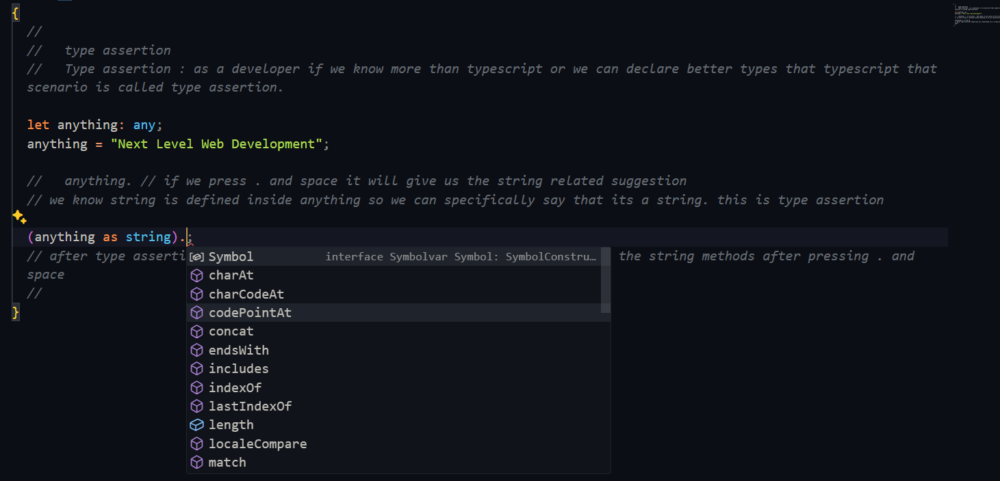

# Advance Types OF Typescript

Welcome back, aspiring TypeScript Technocrat!

In Module 1, you conquered the basics and wrote your first TypeScript program. Now, buckle up as we delve deeper into the world of TypeScript types!

This module focuses on advanced type manipulation techniques that will enable you to write even more robust and flexible code. Here's what you'll explore:

1. Type assertion/type narrowing:

Sometimes TypeScript might be unsure of a variable's type. We'll learn how to give hints (type assertions) and refine types (narrowing) for better code safety.

2. Interface, type vs interface:

Remember data types like numbers and strings? Interfaces are like blueprints for your objects, defining their structure. You'll learn the difference and how to use them effectively.

3. Introduction to generics:

A generic is a feature that allows a function, class, or interface to work with different types of data.

4. Generics with Interfaces:

Combine the power of interfaces and generics! Learn how to build functions that work with objects following specific blueprints (interfaces), keeping your code safe and reusable.

5. Function with generics:

Craft functions that can handle different data types using generics. We'll show you how to define what types your functions can work with.

6. Constraints in typeScript:

Sometimes, you might want to limit the types generics can work with. We'll explore constraints, like setting rules for what types are allowed in your generic functions.

7. Constraint using key of:

Get even more control! Learn how to use a tool called "keyof" to define constraints based on an object's properties.

8. Asynchronous typeScript:

Web development often involves waiting for things. We'll show you how to handle these situations (asynchronous) safely and clearly in TypeScript.

9. Conditional Types:

Imagine types that change based on what happens in your program! Discover conditional types, a powerful feature for creating dynamic type structures.

10. Mapped types:

Want to transform existing types into something new? Explore mapped types, a technique for reshaping types based on your defined rules.

11. Utility Types:

TypeScript comes with built-in helpers (utility types) that offer common functionalities. We'll explore these helpers to make your code shorter and easier to maintain.

By conquering these topics, you'll be well on your way to becoming a TypeScript whiz and crafting superior web applications!

## 2-1 Types Assertion / Type Narrowing

- Type assertion : as a developer if we know more than typescript or we can declare better types that typescript that scenario is called type assertion.

```ts
let anything: any;
anything = "Next Level Web Development";

//   anything. // if we press . and space it will give us the string related suggestion
// we know string is defined inside anything so we can specifically say that its a string. this is type assertion

(anything as string).trim();
// after type assertion typescript will understand its a string and will show the string methods after pressing . and space

anything = 222;

(anything as number).toFixed(0);
//    we are saying that we are sure that the value is a number this is assertion
```



```ts
const kgToGm = (value: string | number): string | number | undefined => {
  if (typeof value === "string") {
    const convertedValue = parseFloat(value) * 1000;
    return `The Converted Value is : ${convertedValue}`;
  }
  if (typeof value === "number") {
    return value * 1000;
  }
};

//   its showing the output could be number string or undefined but as a developer we know we are sending number it will return us number so here we call specifically say that it will return number
const result1 = kgToGm(1000) as number;
const result2 = kgToGm("1000") as string;
//    when we use as ts believes us blindly
```

- We need to be careful when using type assertion since ts will follow us blindly
- If we are sure then we will use type assertion

- we can create type and use as type assertion

```ts
//  as we are sure error contains a message type property we can declare a type
type CustomError = {
  message: string;
};

try {
} catch (error) {
  // We are using TypeScript's type assertion to tell the compiler:"Trust me, error is of type CustomError (an object with a message string)."
  console.log((error as CustomError).message);
}
```

## 2-1 Interface, Types Vs Interface

- we can declare type using interface as well like type

- Structure Of Type

```ts
type User1 = {
  name: string;
  age: number;
};

type User1 = {
  name: string;
  age: number;
};
const user1: User1 = {
  name: "Sazid",
  age: 12,
};
```

- Structure Of Interface

```ts
//    same thing can be done using interface. we can declare type using interface as well
interface User2 {
  name: string;
  age: number;
}

const user2: User2 = {
  name: "Sazid",
  age: 12,
};
```

- Any Object Type variable can be done using type or interface both

#### Type Alias Vs Interface

- Type alias can be use for both primitive and non-primitive
- But Interface can be used for for object only means non-primitive

- So For All Primitive we will use type alias and for all non-primitive we will use interface as well as type

```ts
//   difference between type And interface
type rollNumber = number;
//    we can not use interface here
```

- If we want to extend a property using type alias we use intersection "&"

```ts
type UserWithRole1 = User1 & { role: string };

const user3: UserWithRole1 = {
  name: "Persian",
  age: 29,
};
```

- Extending using Interface

```ts
interface User2 {
  name: string;
  age: number;
}
//    extending using interface
interface UserWithRole2 extends User2 {
  role: string;
}

const user4: UserWithRole2 = {
  name: "Persian",
  age: 29,
  role: "Manager",
};
```

- We Can extend Type and make Interface as well

```ts
type User1 = {
  name: string;
  age: number;
};
//   We Can extend Type and make Interface as well

interface UserWithRole3 extends User1 {
  role: string;
}

const user5: UserWithRole2 = {
  name: "Persian",
  age: 29,
  role: "Manager",
};
```

- Declaring array using interface
- We know in js object is object and array is also a object, function ias also a kind of object
- so we can use interface for array, object and function as well

- Interface in array

```ts
type Roll1 = number[];

const rollNumber1: Roll1 = [1, 2, 3, 4];

//   ________________________ 0, 1, 2, 3 --> number type index holding number type data

//   using interface
interface Roll2 {
  [index: number]: number;
  //number type index holding number type data
}

const rollNumber2: Roll2 = [1, 2, 3, 4];
//
```

- Interface In Function

```ts
//   Interface In Function
type Add1 = (num1: number, num2: number) => number;

const add1: Add1 = (num1, num2) => num1 + num2;

//    using interface

interface Add2 {
  (num1: number, num2: number): number;
}

const add: Add2 = (num1, num2) => num1 + num2;
```

#### For array and Function Type is cleaner than interface so, we will use interface for object and use type for array and function.
